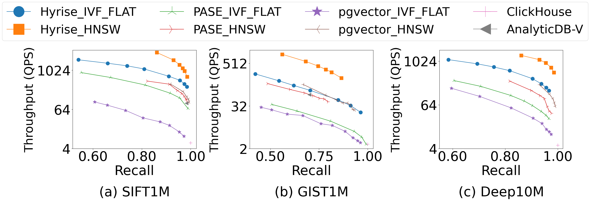
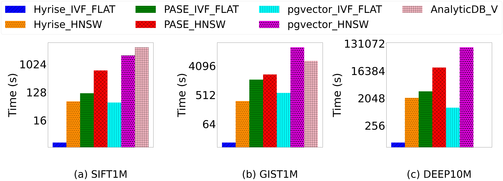
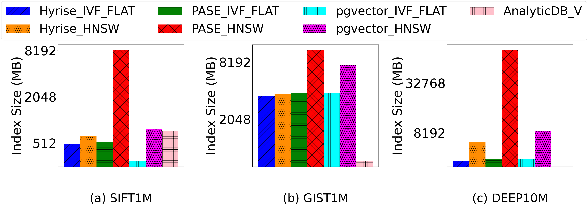

# Welcome to HyriseVector

We present **HyriseVector**, a novel generalized vector database that achieves performance similar to that of highly optimized specialized vector databases. 
At a high level, HyriseVector distinguishes itself from other generalized vector databases in two key aspects. First, it is built on top of Hyrise, a main-memory column-based relational database that we have carefully chosen. Second, HyriseVector treats high-dimensional indexes as first-class citizens. 

Under the hood, HyriseVector introduces a suite of optimizations, including index-centric query optimization that pushes down top-k queries, batch-oriented execution that enables efficient index construction as well as vector similarity search and optimization for multi-core parallelism and SIMD to improve performance. Importantly, many of these design concepts and optimizations are applicable to other relational databases, and we discuss how to extend them to PostgreSQL. 

We compare HyriseVector with **9 vector databases**, including 4 generalized vector databases (PASE, pgvector, AnalyticDB-V, ClickHouse) and 5 specialized vector databases (Faiss, Milvus, Qdrant, Weaviate, and Pinecone), using 3 datasets (SIFT1M, GIST1M, DEEP10M). Experiments demonstrate that HyriseVector achieves performance comparable to that of highly optimized specialized vector databases and improves existing generalized vector databases by up to **40X**.

# Install HyriseVector

Our HyriseVector can be constructed following these steps:

```script
# It is currently not possible to download an anonymized repository neither to clone it.
git clone --recursive git@github.com:Anonymous/hyrise.git -b [#Branch name]     

# Enter the Hyrise directory
cd hyrise 

# Install script handle dependencies
./install_dependencies.sh

# Create the build directory
mkdir cmake-build-debug && cd cmake-build-debug

# Generate Makefiles
cmake ..

# Build the Console
make hyriseConsole -j [#Threads]
```

# Getting started

We can use the SQL sentense below to **create a table with vector variable**.
```sql
CREATE TABLE SIFT_BASE (id INT, dat VECTOR(10));
```

We can use the SQL sentense below to **insert vector data** into the table we have created.
```sql
INSERT INTO SIFT_BASE(id, dat) VALUES (1, VECTOR '[1, 2, 3, 4, 5, 6, 7, 8, 9, 10.1]');
```

We can use the SQL sentense below to **create vector index** of the table we have created and the column we select.
```sql
CREATE INDEX ON SIFT_BASE USING hnsw(dat, L2) WITH(M=16, ef_construction=40, efs=100);
```

We can use the SQL sentense below to **set parameter** in vector index we select.
```sql
SET SIFT_BASE.hnsw.efs=200;
```

We can use the SQL sentense below to search similar vectors according to a batch of queries.
```sql
SELECT id FROM SIFT_BASE ORDER BY dat <$> 
    '[1.1, 2.2, 3.3, 4.4, 5.5, 6.6, 7.7, 8.8, 9.9, 0.1]',
    '[2.2, 3.3, 4.4, 5.5, 6.6, 7.7, 8.8, 9.9, 1.1, 0.1]'
LIMIT 100;
`````

# Experiment results







# Conclusion

In this paper, we present HyriseVector, a generalized vector database that matches the performance of specialized vector databases in search, index construction, and index size. More importantly, HyriseVector improves the performance of existing generalized vector databases by one to two orders of magnitude. In the future, we aim to apply HyriseVector\'s design optimizations into PostgreSQL, and we expect a significant performance improvement.
